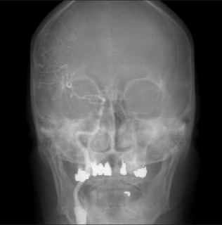
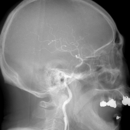

# Par0013 - elastix

###  Image data

* 3D cone-beam CT and 2D x-ray
* Neuro-interventional head/neck
* X-ray pixel size: 0.86 x 0.86 x 1.0 mm; dimension: 256 x 256 x 1

(note: 2D image should be given as 3D image with size = 1 in 3rd dimension ).

* CBCT voxel size: 0.58 x 0.58 x 0.58 mm; dimension: 256 x 256 x 256
* Acquired with an x-ray angiography c-arm system (Allura Xper FD20, Philips Healthcare, Best, The Netherlands) .
* Stored as in MHD format.
* Data originated from the Department of Radiology, University of Massachusetts Medical School, Worcester, MA.

Example data:

See Github link below.

Screen shot:

###  Application

2D-3D registration performance was compared of the combinations of seven optimization methods:

     * Regular step gradient descent
     * Nelder-Mead
     * Powell-Brent
     * Quasi-Newton
     * Nonlinear conjugate gradient
     * Simultaneous perturbation stochastic approximation
     * Evolution strategy

and three similarity measures:

     * Gradient Difference
     * Normalized Gradient Correlation
     * Pattern Intensity.

The similarity measures were added to `elastix` and are **dedicated for 2D-3D use only**.

Experiments were performed on patient data sets that were obtained during cerebral interventions. Various component combinations were evaluated on registration accuracy, capture range, and registration time. The results showed that for the same similarity measure, different registration accuracies and capture ranges are obtained when different optimization methods are used. Overall, it could be concluded that the Powell-Brent is a reliable optimization method for intensity-based 2D-3D registration of x-ray images to CBCT, in terms of accuracy, capture range, and computation time.

###  Registration settings

`elastix` version: 4.5

Parameter files using a single x-ray image are indicated with '_singleImage.txt'.

Command line call using a single x-ray image:

    elastix -f xrayImage.mhd -fMask xrayMask.mhd -m volumeData.mhd -p par0013Powel_NGC_singleImage.txt -out outputdir

Parameter files using multiple x-ray images (note: example shows 2, but more fixed images are accepted) are indicated with '_twoImages.txt'

Command line call using two x-ray images:

    elastix -f0 xrayImage1.mhd -f1 xrayImage2.mhd -f0Mask xrayMask1.mhd -f1Mask xrayMask1.mhd -m volumeData.mhd -p par0013Powell_NGC_twoImages.txt -out outputdir

###  Published in

These registration are described in the publication:

I.M.J. van der Bom, S. Klein, M. Staring, R. Homan, L.W. Bartels, J.P.W. Pluim, "Evaluation of optimization methods for intensity-based 2D-3D registration in X-ray guided interventions", in: SPIE Medical Imaging: Image Processing, SPIE Press, vol. 7962, pp. 796223-1 - 796223-15, 2011.

###  References

[1] I.M.J. van der Bom, S. Klein, M. Staring, R. Homan, L.W. Bartels, J.P.W. Pluim, "Evaluation of optimization methods for intensity-based 2D-3D registration in X-ray guided interventions", in: SPIE Medical Imaging: Image Processing, SPIE Press, vol. 7962, pp. 796223-1 - 796223-15, 2011.
