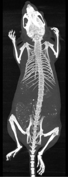
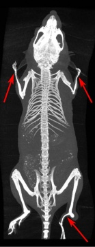

# Par0014 - elastix

###  Image data

* 3D whole-body, in vivo, longitudinal MicroCT of mice
* Voxel size: 0.144 x 0.144 x 0.144 mm
* Dimension: approx. 250 x 200 x 650 voxels
* Data originated from the Department of Endocrinology and Metabolic Diseases, Leiden University Medical Center, Leiden, The Netherlands

###  Application

3D registration was performed using the following:

* Corresponding pointsets on skeleton, lungs and skin (together around 2000 points) were determined using the method described in Baiker et al. 2010 [1]
* Normalized Cross Correlation (NCC) was chosen as similarity measure in combination with the Euclidean Distance (EDM) between the corresponding point sets
* Two step approach: 1) Similarity registration 2) B-Spline registration with EDM measure and without, for comparison
* Both steps using a Gaussian pyramid with 5 (step 1) and 6 (step 2) resolutions respectively
* Optimization using an Adaptive Stochastic Gradient Descent (ASGD)
* Results were evaluated using the Dice Coefficient and the surface distance for the skeleton and the skin and the localization accuracy of the limb joints
* For further details, see the parameter files
* The results are published in Baiker et al. 2011 [2]

Shown are (left to right) 1) Moving image 2) Fixed image 3) Registration with NCC only and 4) Registration with NCC and EDM. The arrows indicate where the registration with the NCC only fails.

###  Registration settings

`elastix` version: 4.403

Parameter file for the NCC B-Spline registration, initialized by a similarity registration:

See Github

Command line call:

    elastix -f fixed_image.mhd -m moving_image.mhd -p parameters.similarity.txt -p parameters.NCC.txt -out resultDir

Parameter file for the NCC plus EDM B-Spline registration, initialized by a similarity registration:

See GitHub

Command line call:

    elastix -f fixed_image.mhd -m moving_image.mhd -fp fixedPointSet.txt -mp movingPointSet.txt -p parameters.similarity.txt
      -p parameters.NCC_EDM.txt -out resultDir

###  References

[1] Baiker, M.; Milles, J.; Dijkstra, J.; Henning, T.; Weber, A.; Que, I.; Kaijzel, E.; Löwik, C.; Reiber, J. & Lelieveldt, B.: Atlas-based whole-body segmentation of mice from low-contrast Micro-CT data. Medical Image Analysis, 2010, 14, 723-737

[2] Baiker, M.; Staring, M.; Löwik, C. W. G. M.; Reiber, J. H. C. & Lelieveldt, B. P. F.: Automated Registration of Whole-Body Follow-Up MicroCT Data of Mice. Medical Image Computing and Computer-Assisted Intervention--MICCAI 2011, Springer, 2011
