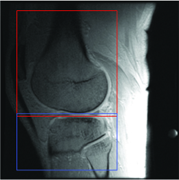

# Par0017 - elastix

###  Image data

* 3D inversion recovery Fast Spoiled Gradient-Recalled echo (FSPGR) sequences, T1-weighted, acquired at a range of inversion times (TI = 100, 200, 400, 800, 2100ms) (Figure 1).
* Knee cartilage, both femoral and tibial cartilage.
* 5 inversion times scans per subject, both in scan and rescan.
* Input format: nifti, output format: dicom
* Field of view = 15x15cm, slice thickness = 3mm, slice spacing = 3mm, in-plane voxel size = 0.6x0.6mm, number of slices = 36.

_Figure 1: T1-weighted images acquired at a range of inversion times._

###  Application

First, registration of the T1-weighted images was performed to improve the T1 map estimation. The scans were rigidly registered in 3D to the T1-weighted scan with the highest contrast (FSPGR(TI=2100)).

Second, registration of the FSPGR(TI=2100) scans was performed to align scan and rescan. Based on this registration, rescan T1 maps were transformed to the scan maps.

Both registration steps were performed with the same registration settings. Femoral and tibial regions were registered separately based on subvolumes containing only the specific bone and surrounding tissue to allow correction for motion of the knee joint (Figure 2). The registration was optimized over 1000 iterations with localized mutual information (LMI) as similarity measure. Per iteration, LMI was calculated using 2048 random samples obtained from a sample region of size 50x50x50 mm. Cubic B-spline interpolation was used when applying the deformation to the moving image.

_Figure 2: Subvolumes for registration on femur and tibia separately._

###  Registration settings

`elastix` version: 4.400

Command line calls:

For the registration of the T1-weighted images:

    elastix -f scan_2100.nii -m scan_TI.nii -out outdir -p params.txt -fMask subvolume_scan.nii -mMask subvolume_scan.nii

For the registration of the scan and rescan FSPGRTI=2100:

    elastix -f scan_2100.nii -m rescan_2100.nii -out outdir -p params.txt -fMask subvolume_scan.nii -mMask subvolume_rescan.nii

###  Published in

These registrations are described in the publication:

_E.E. Bron, J. van Tiel, H. Smit, D.H.J. Poot, W.J. Niessen, G. P. Krestin, H. Weinans, E. Oei, G. Kotek and S. Klein, Image registration improves human knee cartilage T1 mapping with delayed gadolinium-enhanced MRI of cartilage (dGEMRIC), European Radiology, in press_
