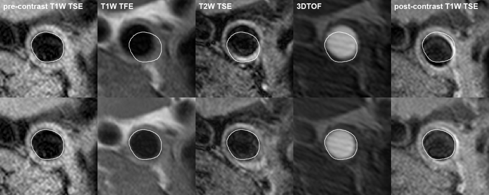

# Par0018 - elastix

###  Registration Description
interpatient; several transformation models; mutual information based similarity metrics	

###  Image data

Multisequence MRI protocol:

* 3D time-of-flight
* 3D T1-weighted TFE
* 2D T2-weighted TSE
* pre-contrast 2D T1-weighted TSE
* post-contrast 2D T1-weighted TSE

MR images of the carotid artery were obtained on a 1.5T scanner using a dedicated carotid surface coil (both Philips Healthcare, Best, the Netherlands).

50 scans of TIA or stroke patients with ipsilateral <70% carotid artery stenosis.

Acquired pixel size was 0.39x0.39 mm2 and slice thickness was 3.0 mm. All images were reconstructed to a pixel size of 0.20x0.20 mm2 in-plane.

Figure: Example of image before (top row) and after registration by the optimal 3D B-spline transformation (bottom row). The fixed image is shown in the first column. The lumen contour of the fixed image (white) is overlaid on all images.

###  Application

Automated registration of multi-sequence MR vessel wall images of the carotid artery. The duration of a multi-sequence MRI protocol is between 30 and 60 minutes. Due to patient movement significant misalignment may occur between the sequences. Automic image registration can be used to correct for patient movement.

###  Registration settings

`elastix` version: 4.400

Command line calls:

    elastix -f fixedImage.mhd -m movingImage.mhd -fMask fixedMask.mhd -out outdir -p params.txt

Succesful registration requires the usage of a mask in the fixed image.

###  Published in

These registrations are described in the publication:

ISMRM Abstract:

Automatic Registration of Multispectral MR Vessel Wall Images of the Carotid Artery R. van 't Klooster, M. Staring, S. Klein, R.M. Kwee, M.E. Kooi, J. H. C. Reiber, B.P.F. Lelieveldt and R.J. van der Geest, International Society for Magnetic Resonance in Medicine, 2012

Full journal publication:

Automated registration of multispectral MR vessel wall images of the carotid artery R. van 't Klooster, M. Staring, S. Klein, R. M. Kwee, M. E. Kooi, J. H. C. Reiber, B. P. F. Lelieveldt and R. J. van der Geest Medical Physics, 40, 121904 (2013)
