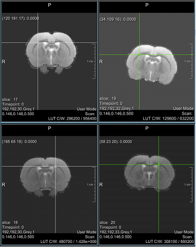

# Par0020 - elastix

###  Image data

* MR 3D multi-contrast rat brain data
* The registration steps were carried out with the first echo (TE1) image of the MSME sequence
* T2-weighted images were acquired using a Multi Slice Multi Echo sequence (MSME; TR/TE=5,000ms/10ms; 10 echoes), DTI was recorded with an 8-shot spin echo EPI sequence (30 directions; b-value=630s/mm2, and five supplementary A0 images)
* Voxel size 0.145833 x 0.145833 x 0.5
* Dimension: 191 x 192 x 30
* Acquired with a Bruker Biospin (Ettlingen, Germany) 11.7T scanner
* Stored in MHD format
* [1], [2]

Screen shot:

An example of the co-registered rat brain data: on the top row two time-points for subject S1 are shown and compared to the bottom row where the same time-points for subject S2 are presented

###  Application

Longitudinal studies on brain pathology and assessment of therapeutic strategies rely on a fully mature adult brain to exclude confounds of cerebral developmental changes. Thus, knowledge about onset of adulthood is indispensable for discrimination of developmental phase and adulthood. We have performed a high-resolution longitudinal MRI study at 11.7 T of male Wistar rats between 21 days and six months of age, characterizing cerebral volume changes and tissue-specific myelination as a function of age.

Data sets of all time points of each individual were registered step-by-step to a template brain starting with the data sets of the 3 month old animals and propagating to the next-closest time point. Using the information provided by the deformation field for each registration step, the template VOIs were propagated from one time point to the next, thereby enabling quantitative comparison of corresponding areas. Subsequently, the VOIs were evaluated quantitatively for MRI parameter changes and for volume change. The quality and success of the registration process was controlled by visual inspection using a custom-made graphic user interface [1].

Cortical thickness reaches final value at 1 month, while volume increases of cortex, striatum and whole brain end only after two months. Myelin accretion is pronounced until the end of the third postnatal month. After this time, continuing myelination increases in cortex are still seen on histological analysis but are no longer reliably detectable with diffusion-weighted MRI due to parallel tissue restructuring processes. In conclusion, cerebral development continues over the first three months of age. This is of relevance for future studies on brain disease models which should not start before the end of month 3 to exclude serious confounds of continuing tissue development [2].

###  Registration settings

`elastix` version: 4.500

Parameter files:

See Github link below

Description:

* par0020rigid.txt the rigid registration was used to initialize the affine registration in all subjects
* par0020affine.txt the affine registration was used to initialize the non-rigid registration in all subjects
* par0020bspline_1.txt used to register non-rigidly 1m time-point to 3w time-point in 5 subjects: LM_25448, LM_25449, LM_25450, LM_25451, LM_26957
* par0020bspline_2.txt used to co-register non-rigidly all the other time-points for all the subjects (besides the exceptions mentioned below): LM_25448, LM_25449, LM_25450, LM_25451, LM_25453, LM_26955, LM_26956, LM_26957
* par0020bspline_3.txt used to register non-rigidly 2m time-point to 1m time-point and 3m time-point to 2m time-point in 1 subject: LM_26956

A fixed image mask was always used. A moving image mask was only used in certain cases.

Command line call:

    elastix -f FixedImage_i.mhd -m MovingImage_j.mhd -fMask FixedImageMask_i (-mMask MovingImageMask_j) -p par0020.txt -out outputdir

with:  = one of {rigid, affine, bspline64, bspline32, bspline16, bspline08, bspline04}

###  Published in

[1] [A. Khmelinskii, L. Mengler, P. Kitslaar, M. Staring, M. Hoehn and B.P.F. Lelieveldt, "A visualization platform for high-throughput, follow-up, co-registered multi-contrast MRI rat brain data," SPIE Medical Imaging: Biomedical Applications in Molecular, Structural, and Functional Imaging, Proceedings of SPIE, vol. 8672, pp. 86721W–86721W-7, February 2013][3]

[2] [L. Mengler, A. Khmelinskii, M. Diedenhofen, C. Po, M. Staring, B.P.F. Lelieveldt and M. Hoehn, "Brain maturation of the adolescent rat cortex and striatum: changes in volume and myelination," NeuroImage, vol. 84, pp. 35–44, January 2014][4]

[3]: http://proceedings.spiedigitallibrary.org/proceeding.aspx?articleid=1674633
[4]: http://www.sciencedirect.com/science/article/pii/S1053811913008963
