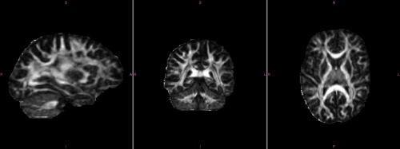

# Par0021 - elastix

###  Registration Description
Registration optimisation for subject-FA images to FA template, multiple data sources	

###  Image data

Rotterdam data:

* DT-MRI, EPI
* Brain
* Matrix size 96 x 64 (pe)
* FOV 210 x 210 mm
* Slice thickness 3.5 mm
* Slices per volume 35
* b-value 1000 s/mm^2
* N-dir 25
* N-b=0 3
* NEX 1
* Acquired with a 1.5 T GE MRI unit.
* Data originated from the Rotterdam Scan Study [1].

Oxford data:

* DT-MRI, EPI
* Brain
* Matrix size 128 x 104 (pe)
* FOV 265 x 208 mm
* Slice thickness 2 mm
* Slices per volume 72
* b-value 1000 s/mm^2
* N-dir 60
* N-b=0 5
* NEX 3
* Acquired with a 1.5 T Siemens MRI unit.
* Data originated from Jbabdi et al., [2].

Screen shot:

###  Application

Registration parameters for the registration of subject-FA images to the FMRIB-58 FA template were optimized using an evaluation framework based on the cross-subject similarity of probabilistic tractography tract-maps. The following parameters were optimized: warp field resolution; similarity metric; multiresolution strategy; regularization weight; optimizer; localization of similarity metric. Parameters were varied in an exhaustive fashion, resulting in 576 different parameter settings per datasource.

All experiments and results are described in the accompanying paper. Optimal registration parameters for both datasets are available for download here, as well as a zip archive containing all 576 parameter files, as well as all parameter files used in the optimization of [FNIRT][3].

###  Registration settings

`elastix` version: 4.5

Command line call:

    elastix -f FMRIB58 -fMask refmask -m FAim -mMask immask -out outdir -p regPoint -t0 affine/TransformParameters.0.txt

###  Published in

These registrations are described in the publication:

M. de Groot, M.W. Vernooij, M.A. Ikram, F Vos, S.M. Smith, W.J. Niessen and J. Andersson, Improving alignment in Tract-based spatial statistics: Evaluation and optimization of image registration., NeuroImage 76, 400-411

###

* The protocols and scripts used for the tractography are available as a [plugin for FSL][4].
* Feel free to contact the corresponding author in case you have questions regarding the use of these parameter files.

###  References

[1] Ikram, M.A., Van der Lugt, A., Niessen, W.J., Krestin, G.P., Koudstaal, P.J., Hofman, A., Breteler, M.M.B., Vernooij, M.W., 2011. The Rotterdam scan study: design and update up to 2012. Eur. J. Epidemiol. 26, 811–824.

[2] Jbabdi, S., Behrens, T.E.J., Smith, S.M., 2010. Crossing fibres in tract-based spatial statistics. NeuroImage 49, 249–256.

[3]: http://fsl.fmrib.ox.ac.uk/fsl/fslwiki/FNIRT
[4]: http://fsl.fmrib.ox.ac.uk/fsl/fslwiki/AutoPtx
